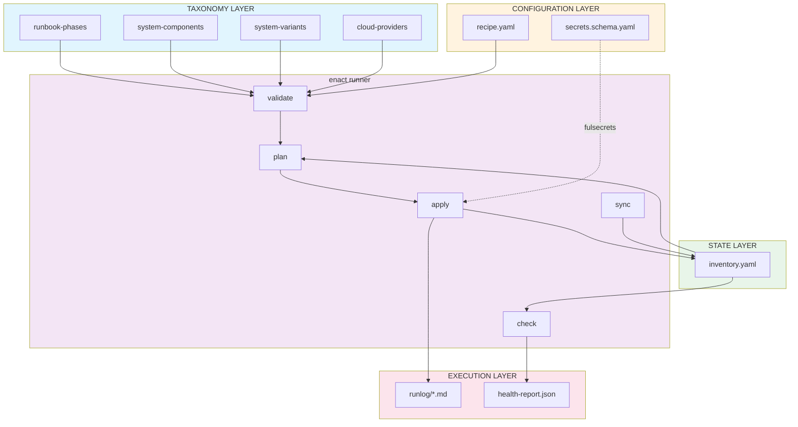

# Enact Schema Architecture

> **Purpose**: Visual map of Enact schema layers and an index to the Enact schema tree.

## Published Namespace

- Base: `https://schemas.fulmenhq.dev/enact/`
- Versioned `$id` base (current): `https://schemas.fulmenhq.dev/enact/v1.0.0/`
- Source tree: `schemas/enact/v1.0.0/`

## Conceptual Model

Enact uses a layered schema architecture where each layer serves a distinct purpose in the deployment lifecycle:

```
┌─────────────────────────────────────────────────────────────────────────────┐
│                              SCHEMA LAYERS                                  │
├─────────────────────────────────────────────────────────────────────────────┤
│                                                                             │
│  ┌─────────────────────────────────────────────────────────────────────┐   │
│  │                         TAXONOMY LAYER                               │   │
│  │                     "What vocabulary exists"                         │   │
│  │                                                                      │   │
│  │   ┌──────────────┐ ┌──────────────┐ ┌──────────────┐ ┌───────────┐  │   │
│  │   │   Runbook    │ │   System     │ │   System     │ │   Cloud   │  │   │
│  │   │   Phases     │ │  Components  │ │   Variants   │ │ Providers │  │   │
│  │   └──────────────┘ └──────────────┘ └──────────────┘ └───────────┘  │   │
│  └─────────────────────────────────────────────────────────────────────┘   │
│                                     │                                       │
│                                     │ validates against                     │
│                                     ▼                                       │
│  ┌─────────────────────────────────────────────────────────────────────┐   │
│  │                         CONFIGURATION LAYER                          │   │
│  │                       "What you want to build"                       │   │
│  │                                                                      │
│  │   ┌────────────────────────────────┐  ┌──────────────────────────┐  │   │
│  │   │            Recipe              │  │     Secrets Schema       │  │   │
│  │   │                                │  │    (documentation)       │  │   │
│  │   └────────────────────────────────┘  └──────────────────────────┘  │   │
│  └─────────────────────────────────────────────────────────────────────┘   │
│                                     │                                       │
│                                     │ runner produces                       │
│                                     ▼                                       │
│  ┌─────────────────────────────────────────────────────────────────────┐   │
│  │                           STATE LAYER                                │   │
│  │                        "What actually exists"                        │   │
│  │                                                                      │
│  │   ┌────────────────────────────────┐                                  │   │
│  │   │          Inventory             │                                  │   │
│  │   └────────────────────────────────┘                                  │   │
│  └─────────────────────────────────────────────────────────────────────┘   │
│                                     │                                       │
│                                     │ runner records                        │
│                                     ▼                                       │
│  ┌─────────────────────────────────────────────────────────────────────┐   │
│  │                          EXECUTION LAYER                             │   │
│  │                         "What happened"                              │   │
│  │                                                                      │
│  │   ┌────────────────────────────────┐  ┌──────────────────────────┐  │   │
│  │   │           Runlog               │  │     Health Report        │  │   │
│  │   └────────────────────────────────┘  └──────────────────────────┘  │   │
│  └─────────────────────────────────────────────────────────────────────┘   │
│                                                                             │
└─────────────────────────────────────────────────────────────────────────────┘
```

## Data Flow



## Directory Structure (Crucible)

Enact schemas are versioned as a coherent suite under a single `v1.0.0` root:

```
schemas/enact/
└── v1.0.0/
    ├── foundation/
    │   ├── types.schema.json
    │   ├── lifecycle-phases.schema.json
    │   └── lifecycle-phases.data.json
    │
    ├── taxonomy/
    │   ├── runbook-phases/
    │   │   ├── runbook-phases.schema.json
    │   │   └── runbook-phases.data.json
    │   ├── system-components/
    │   │   ├── system-components.schema.json
    │   │   └── system-components.data.json
    │   ├── system-variants/
    │   │   ├── system-variants.schema.json
    │   │   └── system-variants.data.json
    │   └── cloud-providers/
    │       ├── cloud-providers.schema.json
    │       └── cloud-providers.data.json
    │
    ├── configuration/
    │   ├── recipe.schema.json
    │   └── secrets.schema.json
    │
    ├── state/
    │   └── inventory.schema.json
    │
    └── execution/
        ├── runlog.schema.json
        ├── health-report.schema.json
        └── metrics.schema.json
```

## Versioning Strategy

- **Schema suite version** is encoded in both the directory and `$id`.
- **Patch**: documentation/examples and non-breaking additions.
- **Minor**: backward-compatible optional fields.
- **Major**: breaking changes.

Example `$id` (versioned URL contract):

```json
{
  "$id": "https://schemas.fulmenhq.dev/enact/v1.0.0/configuration/recipe.schema.json"
}
```

## Schema Conventions

### Taxonomy pattern

Taxonomies have two files:

- `*.schema.json` defines the structure.
- `*.data.json` contains the curated vocabulary values.

### Cross-schema references

Cross-references use absolute URLs (no filesystem-relative `$ref`), e.g.:

```json
{
  "$ref": "https://schemas.fulmenhq.dev/enact/v1.0.0/foundation/types.schema.json#/$defs/slug"
}
```

## Notes

- Enact is intentionally **schema-first** while the CLI and plugin ecosystem hardens.
- A helper-library module spec may arrive later; for now, the schemas are the primary SSOT contract.
