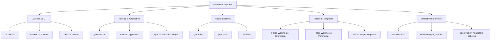

# Fulmen Ecosystem Guide

## Thrive on Scale: The Fulmen Layer Cake

Fulmen empowers teams to build enterprise systems that start fast and scale effortlessly—delivering lightning-speed development without sacrificing reliability or maintainability. Evolving from frustration with trivial boilerplate to a comprehensive ecosystem, Fulmen now integrates single-source-of-truth (SSOT) standards via Crucible, language-specific libraries, automation tools, production-ready forges, and AI-human collaboration to eliminate repeated wheel-reinvention in logging, schemas, enums, and more. Future expansions like Cosmography will extend SSOT to data modeling and topology.

**Core Layers** (hierarchical flywheel: infoarch → implementations → scaffolding → automation → production):

0. **Crucible (Infoarch SSOT)**: Foundational layer for datamodels/schemas, processes/SOPs, and specs/standards. Authoritative contracts, policies, docs, coding rules (e.g., TS barrel exports, logging adapters), and devsecops (pre-commit gates, security scans)—ensuring persnickety excellence and zero silos. Refines practices through rigorous validation, powering the entire cake.

1. **Helper Libraries (\*fulmen)**: Idiomatic implementations of core data and utilities wrapping Crucible assets. Solves cross-project pains like config paths, schema validation, observability, and Foundry catalogs (countries, HTTP statuses, patterns). Current: `gofulmen`, `pyfulmen`, `tsfulmen`; planned: `rsfulmen` (Rust), `csfulmen` (C#) as ecosystem needs evolve.

2. **Templates (Fulmens)**: Proven, production-ready starters embodying CRDL (Clone → Degit → Refit → Launch). Bootstraps projects with embedded Layer 1 libs, AAA (auth/audit/access), observability, testing, and deployment pipelines. Examples: `forge-workhorse-groningen` (Go backend), `forge-workhorse-percheron` (Python backend). Gymnasiums (e.g., TUI experiments) modularize for future integration.

3. **DX/Dev Tools**: Automation layer for governance and productivity. CLI-driven validation, formatting, sync, approvals, and orchestration. Key tools:
   - `goneat`: Quality enforcement (linting, schema validation, hooks; v0.3+ stricter assessments).
   - `fulward`: Protection and approval workflows (successor to guardian; centralizes commit/release policies).
   - `sumpter`: Build and CLI orchestration (emerging for streamlined compilation/packaging across layers).
   - `pathfinder`: Safe file discovery with constraints.
     Future: Release note automation, environment bootstraps.

4. **Apps/Services (Operational & Production)**: Deployable systems composing lower layers for real-world scale. Includes workflow orchestration, analytics, and AI enablement:
   - `brooklyn-mcp`: MCP server for Fulmen workflows, IDE/AI integration.
   - Data wrangling utilities and observability defaults (Substaile patterns for docs/coding norms).
   - Production forges (e.g., multi-tenant portals, API gateways) and analytics platforms.
     AI agents (Schema Cartographer, Pipeline Architect) maintain via MAINTAINERS.md roles (dev, devsecops, docs, architects), with human oversight.

Layers compose into a virtuous cycle: Refine standards in Crucible → Sync to libraries → Automate via tools → Deploy via forges → Iterate with AI oversight. This prevents siloed reinvention, enabling teams to focus on unique value while thriving at enterprise scale.

## Evolution: From Templates to Ecosystem Flywheel

| Phase               | Timeline     | Key Evolution                                                                                                                | Outcomes                                                                                                   |
| ------------------- | ------------ | ---------------------------------------------------------------------------------------------------------------------------- | ---------------------------------------------------------------------------------------------------------- |
| **Inception**       | Feb–Apr 2025 | Frustration with boilerplate → Build functional forges via CRDL (Clone → Degit → Refit → Launch).                            | Proven "complete systems" accelerate teams to production-scale without basics drudgery.                    |
| **Standards Forge** | May–Jul 2025 | Realized repeated pains (logging, schemas, enums) → Crucible as SSOT for contracts/docs/processes; prototype goneat/Fulward. | Centralized standards prevent reinvention; early libs (gofulmen) emerge for idiomatic access.              |
| **Consolidation**   | Aug–Sep 2025 | Ecosystem sprawl → Align libs (pyfulmen, tsfulmen), tools (brooklyn-mcp), AI co-maintainers; draft Substaile coding norms.   | Module parity across langs; MCP integrates workflows; human-AI roles defined in MAINTAINERS.md.            |
| **Scale Wave**      | Oct 2025+    | Full flywheel → Foundry catalogs, CalVer releases, Cosmography (data SSOT); AI stewardship for maintenance.                  | Multi-lang readiness; workhorse forges leverage ecosystem; "Thrive on Scale" realized via composed layers. |

## Ecosystem Map

## Layer-by-Layer Details

### 0. Crucible (Infoarch SSOT)

- **Purpose**: Purifies foundational elements—datamodels (schemas), processes (SOPs), and specs (standards)—enabling massive scale through validation and real-world proofing.

- **Key Assets**: `schemas/` (JSON contracts), `docs/standards/` (coding/devsecops), `config/` (catalogs/taxonomy), sync targets for languages.

- **Quality Gates**: `make check-all` (validation, lint, tests), fulward approvals, CalVer releases with notes. AI agents enforce via protocols.

- **Why it matters**: As Layer 0, Crucible is the forge; all upper layers sync from here, preventing silos and ensuring interoperability. Future: Cosmography for data topology SSOT.

### 3. DX/Dev Tools

- **goneat**: Fulmen-native CLI for formatting, linting, schema validation, and hook orchestration. v0.3.0 introduces stricter assessments; v0.4.x slims binary as approvals migrate to fulward.

- **Fulward**: Successor to guardian; centralizes policies for commits, releases, and ops in `../fulward`. goneat's `guardian` subcommand bridges temporarily.

- **Sumpter**: Emerging build/CLI orchestrator (`../sumpter`) for compilation, packaging, and cross-layer workflows.

- **Pathfinder**: Safe file discovery with Crucible schemas for constraints.

- **Scripts**: `scripts/validate-schemas.ts`, `sync-to-lang.ts`, version tools ensure SSOT sync.

- **Future**: Auto-release notes, env bootstraps, AI-integrated DX (e.g., via brooklyn-mcp).

### 1. Helper Libraries (\*fulmen)

- **Repositories**: `gofulmen`, `pyfulmen`, `tsfulmen`; planned: `rsfulmen` (Rust), `csfulmen` (C#) as needs evolve.

- **Core Modules**: Config path API, three-layer config, schema validation, Crucible shim, SSOT sync, observability logging, Foundry catalogs (patterns, HTTP statuses, countries, MIME types).

- **Testing Targets**: Coverage per `config/library/v1.0.0/module-manifest.yaml` (e.g., Go ≥95%, TS ≥85%).

- **Role**: Idiomatic wrappers for Layer 0 assets; embed schemas for zero-dependency runtime use in upper layers.

### 2. Templates (Fulmens)

- **Current**: `forge-workhorse-groningen` (Go backend template), `forge-workhorse-percheron` (Python backend template). Future forges will expand patterns for CLI tools, frontends, and specialized services.

- **Philosophy**: CRDL (Clone → Degit → Refit → Launch). Ship complete systems with Layer 1 libs, AAA (auth/audit/access), observability (Layer 0 schemas), testing, CI/CD, and docs—production-ready from commit zero.

- **Gymnasiums**: Experimental playgrounds (TUIs, metrics analyzers); e.g., “forge-gymnasium-ginkgo” for modular components.

- **Roadmap**: Vertical expansions (automation, gateways, ingestion); default Crucible/goneat integration. Tie to `config/taxonomy/repository-categories.yaml` for role advertisement.

- **Docs**: Align forge READMEs with this guide/manifesto for consistency.

### 4. Apps/Services (Operational & Production)

- **brooklyn-mcp**: MCP orchestration server; integrates workflows, AI agents, IDEs for Layer 3+ automation.

- **Data Utilities**: Wrangling, validation, scaffolding for Fulmen services; leverages Layer 1 for observability.

- **Substaile**: Doc-enforced coding norms (prototype; merging into Crucible standards for Layer 0 enforcement).

- **Production Forges**: Scalable apps (portals, gateways, analytics) composing layers; e.g., multi-tenant systems with AAA/telemetry defaults.

- **AI Enablement**: Agents (Schema Cartographer for standards, Pipeline Architect for workflows) per `MAINTAINERS.md`; human-AI collab with .plans/, approvals, audits.

## How Layers Compose & Sync

The flywheel: Layer 0 refines → Layer 1 embeds → Layer 2 scaffolds → Layer 3 automates → Layer 4 deploys/iterates.

| Source (Layer)      | Target Layers                | Mechanism                                        | Notes                                                   |
| ------------------- | ---------------------------- | ------------------------------------------------ | ------------------------------------------------------- |
| Crucible (0)        | 1 (Libraries), 2 (Templates) | `bun run sync:to-lang`; pull scripts             | Assets (schemas/docs/config) propagate via CalVer tags. |
| Libraries (1)       | 2 (Templates), 4 (Apps)      | Package deps (go get, bun add)                   | Idiomatic APIs; embed for zero-runtime deps.            |
| Tools (3)           | All upper layers             | CLI integration (goneat hooks, fulward policies) | Automate governance; e.g., precommit syncs Layer 0.     |
| Templates (2)       | 4 (Apps)                     | CRDL (degit/clone) + refit                       | Bootstraps with Layers 0-3; gyms for experiments.       |
| Future: Cosmography | Layer 0 extensions           | Sync pipelines (planned)                         | Data modeling/topology SSOT.                            |

## Working Across the Ecosystem

1. **Author standards in Crucible** → run `make check-all` → release (CalVer) → generate
   release notes.
2. **Sync language wrappers** → cut releases of `*fulmen` libraries once they pass their
   own `make check-all`.
3. **Update forges** → incorporate new library releases, add instructions for clone →
   degit → refit flows.
4. **Validate automation** → ensure goneat tasks and Fulward policies support the new patterns.
5. **Communicate** → document in ecosystem guide/manifesto, publish release notes, loop
   in AI agents for maintenance.

## Where This Content Lives

- `docs/architecture/fulmen-technical-manifesto.md` – Deep dive on philosophy, design
  principles, and implementation examples.
- `docs/guides/` – Task-oriented docs (bootstrap guides, sync instructions).
- `docs/standards/` – Normative requirements (logging, library modules, repository
  safety).
- `release-notes/` – Per-release highlights.

Fulmen continues to be the fastest path from zero to production-grade systems—made even
stronger now that the ecosystem shares a single source of truth, automation toolkit, and
AI-assisted stewardship. Cosmography is next in line to follow Crucible’s public launch,
extending the SSOT strategy into spatial and mapping domains.

## Next Steps

- Complete workhorse forge refreshes (Groningen, Percheron) using the updated library
  modules and guardian policies.
- Expand Substaile into a formal Crucible module or dedicated repository for coding
  standards.
- Automate CalVer release note generation from the checklist.
- Publish an ecosystem landing page synthesizing this guide for external readers.

Fulmen continues to be the fastest path from zero to production-grade systems—made even
stronger now that the ecosystem shares a single source of truth, automation toolkit, and
AI-assisted stewardship.
