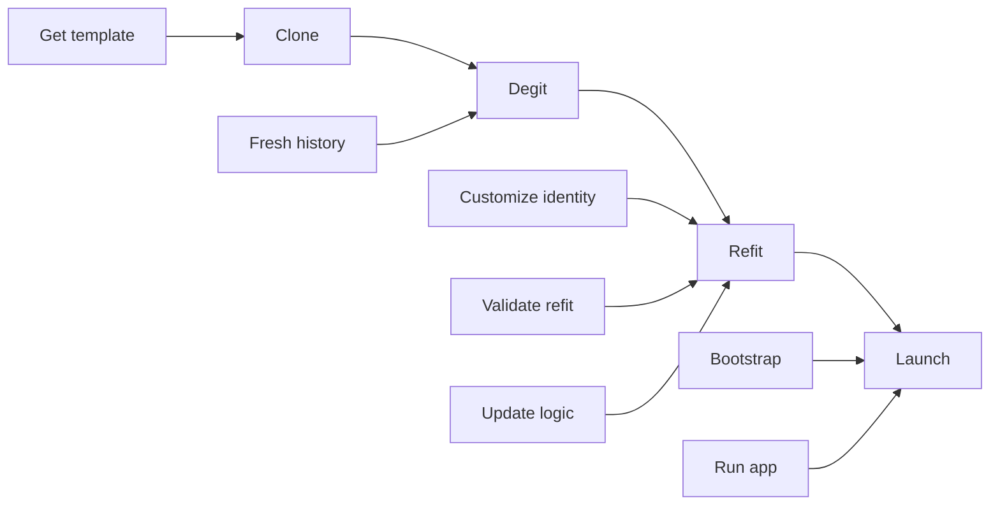

# CDRL Workflow Guide

## Overview

This guide provides step-by-step instructions for customizing Fulmen forge templates into production applications using the **CDRL (Clone → Degit → Refit → Launch)** workflow.

**Audience**: Developers deploying Fulmen templates
**Prerequisites**: Git, appropriate runtime (Go, Bun/Node, Python), make
**Time**: ~10 minutes from clone to running custom app

**Architecture Reference**: See [Fulmen Template CDRL Standard](../../architecture/fulmen-template-cdrl-standard.md) for design rationale and compliance requirements.

## CDRL Workflow Overview



**Four Stages**:

1. **Clone**: Acquire template from GitHub
2. **Degit**: Remove template's git history, start fresh
3. **Refit**: Customize template for your application (most important)
4. **Launch**: Run your customized application

## Step-by-Step Instructions

### Step 1: Clone the Template

Choose your forge template based on use case:

**Workhorse Templates** (backend services):

```bash
# Go-based HTTP API
git clone https://github.com/fulmenhq/forge-workhorse-groningen.git my-app

# Python-based HTTP API
git clone https://github.com/fulmenhq/forge-workhorse-percheron.git my-app

# TypeScript-based HTTP API (future)
git clone https://github.com/fulmenhq/forge-workhorse-{breed}.git my-app
```

**Codex Templates** (documentation sites):

```bash
# Astro + Starlight documentation site (future)
git clone https://github.com/fulmenhq/forge-codex-aurora.git my-docs
```

**Navigate into directory**:

```bash
cd my-app  # or my-docs
```

### Step 2: Degit (Remove Git History)

Remove the template's git history to start fresh:

```bash
rm -rf .git
git init
```

**Why?** You don't want the template's commit history in your application repository. Degit creates a clean slate for your project's history.

### Step 3: Refit (Customize for Your Application)

This is the **most important step**. Follow substeps carefully.

#### 3.1 Update App Identity (PRIMARY STEP)

Edit `.fulmen/app.yaml` to match your application:

```yaml
# .fulmen/app.yaml - EDIT THESE VALUES
vendor: mycompany # Your organization (lowercase, no spaces)
binary_name: myapi # Your application name (lowercase, no spaces)
service_type: workhorse # Keep this (workhorse | codex)
env_prefix: MYAPI_ # Environment variable prefix (UPPERCASE, trailing underscore)
config_name: myapi # Config file/directory name (lowercase)
description: "My API service for processing customer data"
version: 1.0.0 # Your app version (start at 1.0.0)
```

**Critical Fields**:

- `vendor`: Your organization's namespace (e.g., `acme`, `techcorp`, `fulmenhq`)
- `binary_name`: Your application identifier (e.g., `user-service`, `data-processor`)
- `env_prefix`: Environment variable prefix (e.g., `USERSVC_`, `DATAPROC_`, `MYAPI_`)

**Why This Matters**: All customization flows from this file. Helper libraries read it to configure:

- Environment variable prefixes
- Configuration file paths (`~/.config/{vendor}/{config_name}/`)
- Telemetry namespaces (logging service names, metric prefixes)
- CLI help text and HTTP responses

#### 3.2 Validate App Identity (CRITICAL)

Run validation to detect hardcoded template names:

```bash
make validate-app-identity
```

**Expected Output** (success):

```
✅ No hardcoded breed references found
```

**If Validation Fails**:

```
❌ Found hardcoded references to 'groningen':
  - src/internal/cmd/root.go:45
  - config/groningen.yaml
  - docs/README.md:12
```

**Action**: Edit reported files, replace template name with your app name (or reference App Identity).

#### 3.3 Update Module Path (Language-Specific)

**Go (`go.mod`)**:

```go
// Before
module github.com/fulmenhq/forge-workhorse-groningen

// After
module github.com/mycompany/myapi
```

**Python (`pyproject.toml`)**:

```toml
# Before
name = "forge-workhorse-percheron"

# After
name = "myapi"
```

**TypeScript (`package.json`)**:

```json
{
  "name": "@mycompany/myapi"
}
```

#### 3.4 Update Environment Variables

Copy `.env.example` to `.env` and customize:

```bash
cp .env.example .env
```

Edit `.env` to use your prefix from App Identity:

```bash
# Before (template default)
GRONINGEN_PORT=8080
GRONINGEN_HOST=localhost
GRONINGEN_LOG_LEVEL=info

# After (your app)
MYAPI_PORT=8080
MYAPI_HOST=localhost
MYAPI_LOG_LEVEL=info
```

**All environment variables MUST use your `env_prefix`** from `.fulmen/app.yaml`.

#### 3.5 Rename Configuration Files

**Workhorse templates**:

```bash
# Rename config file
mv config/groningen.yaml config/myapi.yaml
# (Replace 'groningen' with your template's breed name)
```

**Codex templates**:

```bash
# Usually config/site.yaml already (no rename needed)
# But update contents with your site name, URL, etc.
vim config/site.yaml
```

#### 3.6 Customize Business Logic

Remove template placeholder logic and add your own:

**Workhorse (Go example)**:

```bash
# Remove template examples
rm -rf internal/core/handlers/example.go
rm -rf internal/core/services/example.go

# Add your business logic
mkdir -p internal/core/handlers
mkdir -p internal/core/services
# Add your handlers, services, models here
```

**Codex (Astro example)**:

```bash
# Update content
rm -rf src/content/docs/example/
mkdir -p src/content/docs/your-section/
# Add your documentation
```

#### 3.7 Update Documentation and Metadata

**README.md**:

- Replace template name with your app name
- Update description and usage examples
- Add your own quick start instructions

**LICENSE**:

- Choose your license (MIT, Apache 2.0, proprietary, etc.)
- Update copyright holder

**MAINTAINERS.md**:

- Replace template maintainers with your team
- Update support channels

**Example README update**:

```markdown
# Before

# Groningen - Production-Ready Go Workhorse

# After

# MyAPI - Customer Data Processing Service
```

#### 3.8 Comprehensive Validation (FINAL CHECK)

Run the doctor command for comprehensive validation:

```bash
make doctor
```

**Expected Output** (success):

```
✅ App Identity: Valid
✅ Environment Variables: Consistent prefix (MYAPI_)
✅ Configuration Paths: Match identity
✅ Module Path: Updated
✅ Tests: Passing
🎉 CDRL refit complete - ready to launch!
```

**If Doctor Reports Issues**:

- Follow suggestions in output
- Re-run after fixes
- All checks must pass before launch

### Step 4: Launch Your Application

#### 4.1 Bootstrap Dependencies

```bash
make bootstrap
```

This installs:

- **Development tools** (goneat, etc.) - pinned versions for reproducibility
- **Language dependencies** (packages, modules, libraries)

**What Happens**:

- Reads `.goneat/tools.yaml` manifest
- Downloads tools to `bin/` directory with checksum verification
- Installs language-specific dependencies (Go modules, Python packages, npm/bun packages)

**Expected Output**:

```
🔧 Bootstrapping development environment...
🛠️  Installing external tools (goneat)...
  📥 Downloading from https://github.com/fulmenhq/goneat/releases/...
  ✓ Checksum verified
  ✓ Installed to bin/goneat
📦 Installing dependencies...
  ✓ Dependencies installed
✅ Bootstrap complete!
```

**Reference**: See [Reference Bootstrap Pattern](reference-bootstrap.md) for implementation details.

#### 4.2 Run Your Application

**Development Mode**:

```bash
make run
# Or language-specific:
go run ./cmd/myapi     # Go
bun run dev             # TypeScript
uv run python -m myapi  # Python
```

**Production Build**:

```bash
make build
./bin/myapi serve       # Run built binary (Go)
# Or language-specific equivalents
```

#### Verify Customization

**Check version endpoint** (workhorse):

```bash
curl http://localhost:8080/version
```

Expected response should show YOUR app name:

```json
{
  "service": "myapi",
  "version": "1.0.0",
  "crucible_version": "0.2.8"
}
```

**Check logs** - should use your service name:

```
{"service":"myapi","level":"info","msg":"Starting HTTP server on :8080"}
```

## Verification Checklist

After completing CDRL, verify:

- [ ] App identity loads from `.fulmen/app.yaml`
- [ ] Environment variables use your prefix (e.g., `MYAPI_*`)
- [ ] Config file loads from correct path
- [ ] CLI shows your app name in help (`--help`)
- [ ] HTTP `/version` endpoint shows your app name
- [ ] Logs use your telemetry namespace
- [ ] Tests pass with `make test`
- [ ] Validation passes: `make validate-app-identity` ✅
- [ ] Doctor passes: `make doctor` ✅

## Common Customization Patterns

### Web API Service

```yaml
# .fulmen/app.yaml
vendor: acme
binary_name: user-service
service_type: workhorse
env_prefix: USERSVC_
config_name: user-service
description: "User management API service"
version: 1.0.0
```

**Use Case**: RESTful API, authentication, CRUD operations

### Data Processing Worker

```yaml
# .fulmen/app.yaml
vendor: datatech
binary_name: etl-processor
service_type: workhorse
env_prefix: ETL_
config_name: etl-processor
description: "ETL data processing worker"
version: 1.0.0
```

**Use Case**: Background jobs, data pipelines, batch processing

### CLI Tool

```yaml
# .fulmen/app.yaml
vendor: toolcorp
binary_name: db-migrator
service_type: workhorse
env_prefix: DBMIG_
config_name: db-migrator
description: "Database migration CLI tool"
version: 1.0.0
```

**Use Case**: Command-line utilities, scripts, automation tools

### Documentation Site

```yaml
# .fulmen/app.yaml
vendor: acme
binary_name: acme-docs
service_type: codex
config_name: site
description: "Acme Corporation documentation portal"
version: 1.0.0
```

**Use Case**: Product docs, API references, knowledge bases

## Troubleshooting

### App Identity Not Loading

**Symptom**: Application doesn't recognize identity fields

**Diagnosis**:

```bash
# Check file exists
ls -la .fulmen/app.yaml

# Check YAML syntax
cat .fulmen/app.yaml
```

**Solutions**:

- Ensure file exists at `.fulmen/app.yaml` (exact path)
- Validate YAML syntax (no tabs, proper indentation)
- Check helper library version supports App Identity

### Environment Variables Not Working

**Symptom**: App doesn't read env vars with your prefix

**Diagnosis**:

```bash
# Check prefix matches app.yaml
grep env_prefix .fulmen/app.yaml

# List your env vars
env | grep MYAPI_  # Replace MYAPI_ with your prefix
```

**Solutions**:

- Ensure `.env` uses correct prefix from app.yaml
- Restart application after changing env vars
- Check helper library loads prefix from App Identity

### Config File Not Found

**Symptom**: Application can't load configuration

**Diagnosis**:

```bash
# Check expected path (Linux/macOS)
ls -la ~/.config/mycompany/myapi/config.yaml

# Check app identity config_name
grep config_name .fulmen/app.yaml
```

**Solutions**:

- Create directory: `mkdir -p ~/.config/{vendor}/{config_name}/`
- Copy config: `cp config/myapi.yaml ~/.config/{vendor}/{config_name}/config.yaml`
- Or specify custom path: `myapi serve --config ./config/custom.yaml`

### Validation Fails with Hardcoded References

**Symptom**: `make validate-app-identity` reports template name in code

**Example**:

```
❌ Found 'groningen' in src/internal/cmd/root.go:45
```

**Solutions**:

1. **Load from App Identity**:

   ```go
   // Before
   log.Info("Starting groningen server")

   // After
   identity := appIdentity.Load()
   log.Info("Starting %s server", identity.BinaryName)
   ```

2. **Update configuration references**:

   ```go
   // Before
   configPath := "config/groningen.yaml"

   // After
   identity := appIdentity.Load()
   configPath := fmt.Sprintf("config/%s.yaml", identity.ConfigName)
   ```

3. **Re-run validation** after fixes

### Tests Fail After Refit

**Symptom**: `make test` fails with identity errors

**Diagnosis**:

```bash
# Run tests verbosely
make test-verbose
# Or language-specific
go test -v ./...
```

**Solutions**:

- Update test fixtures to use new identity
- Mock App Identity in tests
- Check test configuration paths
- Ensure test environment variables use new prefix

## Advanced Customization

### Adding New Commands (Workhorse)

1. Create command file: `internal/cmd/mycommand.go`
2. Implement command using CLI framework (Cobra, Click, etc.)
3. Register in root command: `rootCmd.AddCommand(myCommand)`
4. Update `Makefile` if command needs special target

### Adding New HTTP Endpoints (Workhorse)

1. Create handler: `internal/server/handlers/myhandler.go`
2. Register route: Update `internal/server/routes.go`
3. Add middleware if needed
4. Write tests: `internal/server/handlers/myhandler_test.go`

### Custom Configuration Fields

1. Add fields to config struct
2. Set defaults in `setDefaults()` function
3. Add corresponding environment variables to `.env.example`
4. Document in README

### Adding Build-Time Content (Codex)

1. Add content ingestion scripts: `src/scripts/ingest-*.ts`
2. Update build pipeline in `package.json` or `Makefile`
3. Configure sources in `config/site.yaml`
4. Document provenance (source_repo, synced_at)

## Best Practices

1. **App Identity First**: Always edit `.fulmen/app.yaml` before anything else
2. **Validate Early, Validate Often**: Run validation after each major change
3. **One Source of Truth**: Derive all customization from App Identity
4. **Test Thoroughly**: Run full test suite after refit
5. **Document Changes**: Update README with your app's specifics
6. **Version Sensibly**: Use SemVer for your app (independent of Crucible)
7. **Security First**: Never commit secrets, API keys, or credentials
8. **Clean History**: Degit removes template history - start with clean commits

## Template-Specific Guides

Each forge template SHOULD provide its own detailed CDRL guide:

- **Groningen (Go)**: `docs/development/fulmen_cdrl_guide.md`
- **Percheron (Python)**: `docs/development/fulmen_cdrl_guide.md`
- **Aurora (Codex)**: `docs/development/fulmen_cdrl_guide.md`

**Check your template's docs** for language-specific and forge-specific customization details.

## Support and Resources

### Documentation

- [Fulmen Template CDRL Standard](../../architecture/fulmen-template-cdrl-standard.md) - Architectural requirements
- [App Identity Module](../library/modules/app-identity.md) - Technical specification
- [Fulmen Forge Workhorse Standard](../../architecture/fulmen-forge-workhorse-standard.md) - Workhorse requirements
- [Fulmen Forge Codex Standard](../../architecture/fulmen-forge-codex-standard.md) - Codex requirements

### Community

- **Template Issues**: Report to specific forge repository (e.g., `forge-workhorse-groningen`)
- **CDRL Standard**: Report to [Crucible](https://github.com/fulmenhq/crucible)
- **Helper Libraries**: Report to language-specific repo (gofulmen, pyfulmen, tsfulmen)

### Quick Links

- [FulmenHQ Organization](https://github.com/fulmenhq)
- [Crucible Repository](https://github.com/fulmenhq/crucible)
- [Helper Libraries](https://github.com/fulmenhq?q=fulmen)

---

**Remember**: CDRL makes template customization predictable and repeatable. The App Identity system ensures most customization happens in one place (`.fulmen/app.yaml`) rather than scattered throughout the codebase. Follow the workflow, validate thoroughly, and launch with confidence!

**Maintainers**: Schema Cartographer, @3leapsdave
**Status**: Approved for v0.2.8 release
**Next Review**: 2025-12-07 (30 days)
